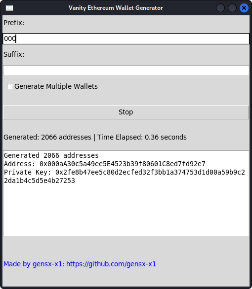

## Vanity-Python
ETH vanity address generator made in python made by me, loosely based on https://github.com/bokub/vanity-eth

A vanity address is an address in which you can choose a part of it to make it appear less random.
Examples:
```
0xc0ffee254729296a45a3885639AC7E10F9d54979
0x999999cf1046e68e36E1aA2E0E07105eDDD1f08E
```

### Requiremnts:
```
web3
```
### Usage:
```
git clone https://github.com/gensx-x1/Vanity-Python.git
python3 Vanity-Python
```

### Screenshots:



## Donations are very welcome:
0x4673bB013Fb9d0d2585003b94B837b25F6dFd57d
